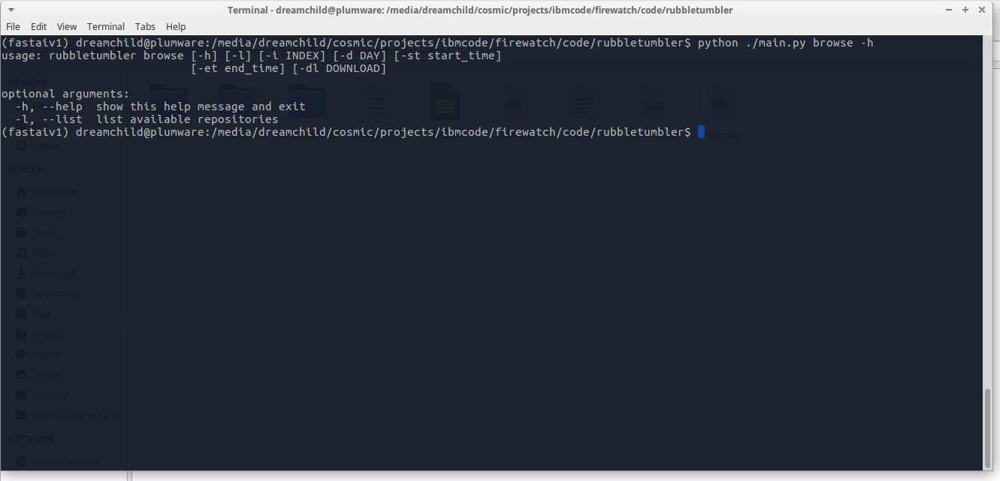

# rubbletumbler



A simple tool to help you download and import HDF data into your relational database

### Goals
+ Browse the RDF files available in a HTTP repository
+ Specify a time window to select and download available files
+ Save RDF file data to a database

## Usage

```
rubbletumbler browse -l
```
List available repositories

```
rubbletumbler browse --index 0 -d 180 --st 13:00 --et 15:00 --download ./dump
```

Show HDF files from repo 0 (Temperature anomaly data) for dates between 1 PM and 3 PM. Download files to folder 'dump'

```
rubbletumbler save --folder ./dump --url dburl --username john --password smith
```
Save files that were dumped in folder 'dump' to database using the given **url**, **username** and **password**